## Ficsit-Network : Unlock Each Step

This document explains how to unlock each milestone in the `MAM` in order to get the full experience of `Ficsit Networks`

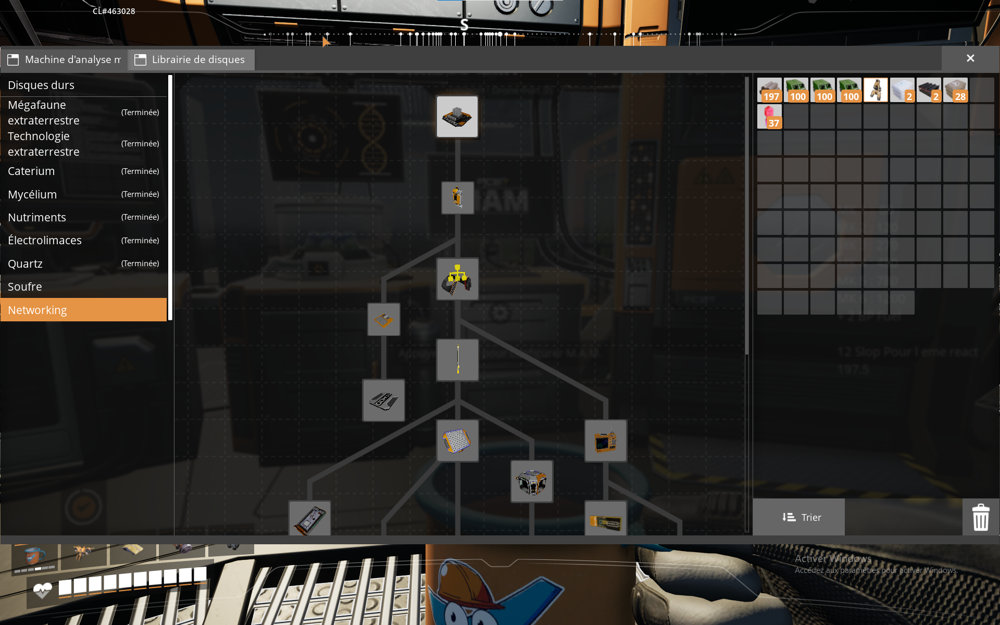

---

## Hello World
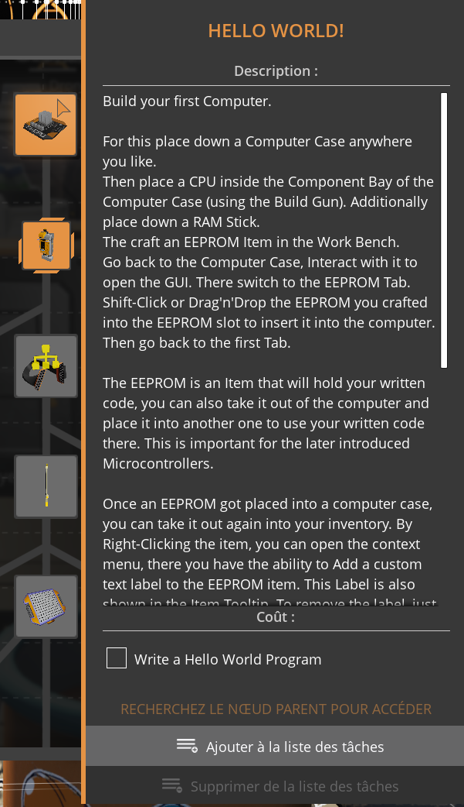

The first step is to verify that your computer and EEPROM are working correctly.

### Requirements
- 1 × Computer
- 1 × CPU
- 1 × Stick of RAM
- 1 × EEPROM (Text)
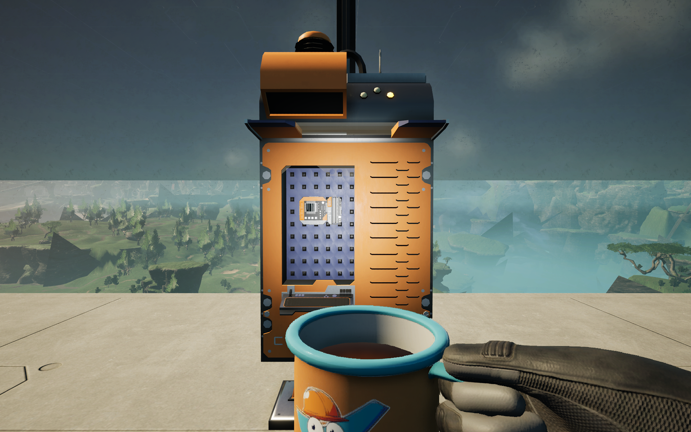

### Procedure
- Place a Computer in the world.
- Insert a Text EEPROM into the computer.
- Open the EEPROM editor.
- Insert the following Lua code.
``` lua
print("Hello World")
```

### Expected Result
When the program runs, the computer console should display:
```
Hello World
```
If you see this message, your Ficsit Networks computer is working correctly and you can proceed to the next MAM unlock step.

🎬 YouTube Tutorial : [FicsIt-Networks - Lua - Hello World | #01](https://youtu.be/FeJYjMnLydo?si=oIcrHGwR4Ksf8x11)

---

## Write Something in a file
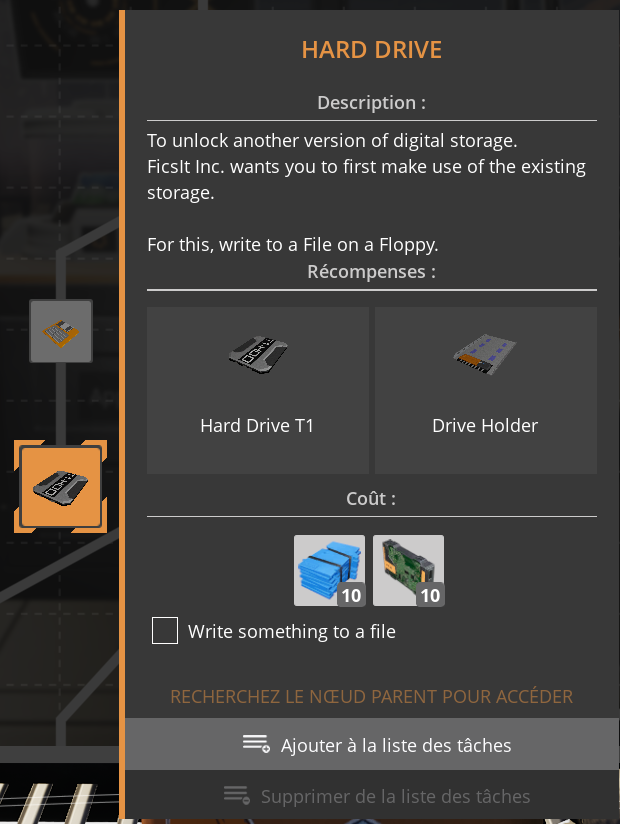

The next step is to add a floppy to your computer.

### Requirements
- 1 × Computer
- 1 × CPU
- 1 × Stick of RAM
- 1 × EEPROM (Text)
- 1 × Floppy drive


### Procedure
- Place a Computer in the world.
- Insert a Text EEPROM into the computer.
- Insert a floppy drive (Get the UUID by passing your mouse hover) / Or use the Explorer Windows
- Open the EEPROM editor.
- Insert the following Lua code.
``` lua
-- Write_Something_to_a_file.lua : exemple court pour écrire un fichier avec Ficsit Networks (FIN)
-- 1) Adapte DISK_UUID à ton disque
-- 2) Lance le script sur l'ordinateur FIN

local fs = filesystem
local DISK_UUID = "REMPLACE_PAR_UUID_DU_DISQUE"
local PATH = "/note.txt"

fs.initFileSystem("/dev")
fs.mount("/dev/" .. DISK_UUID, "/")

local f = fs.open(PATH, "w") -- "w" = écrase ; utiliser "a" pour append
if not f then
    print("Erreur: impossible d'ouvrir " .. PATH)
    return
end

f:write("Bonjour depuis Ficsit Networks!\n")
f:write("Timestamp: " .. tostring(computer.millis()) .. " ms\n")
f:close()

print("OK: fichier écrit -> " .. PATH)
```
### Expected Result
When the program runs, the computer console should display:
```
OK: fichier écrit -> /note.txt
```
If you see this message, you have write "Bonjour depuis Ficsit Networks!..." in the file
and you can proceed to the next MAM unlock step.

---

## Proxy an Nework Component
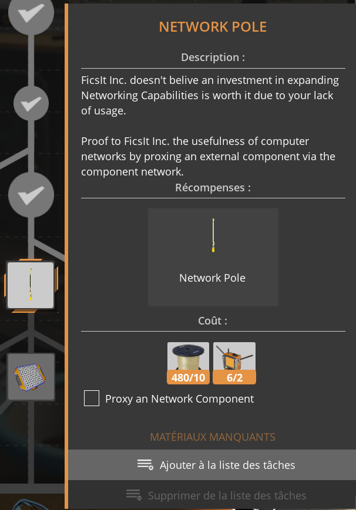

The next step is to connect the computer to a something to creat a Network

### Requirements
- 1 × Computer
- 1 × CPU
- 1 × Stick of RAM
- 1 × EEPROM (Text)
- 1 × Portable Network Manager (You need to unloak this one before)

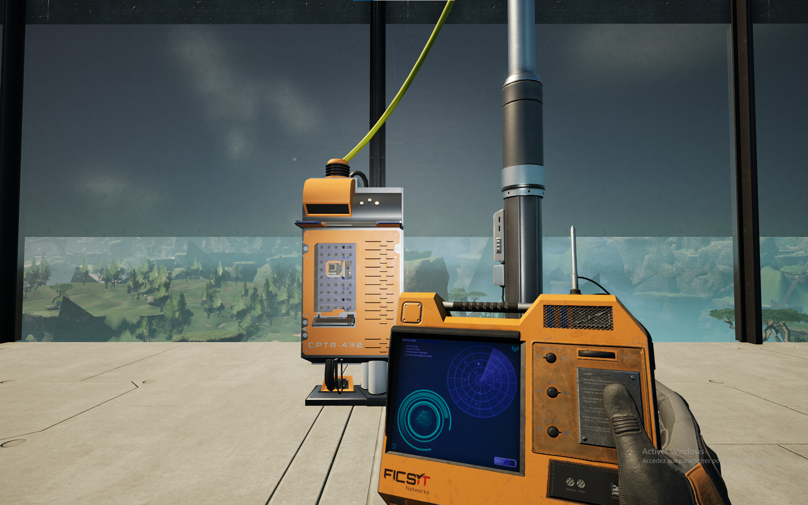

### Procedure
- Place a power pole in the word
- Set the name of the power pole with the Portable Network manager in hand to "PowerPole"
- Place a Computer near the power pole.
- Connect both together with a Network Cable
- Insert a Text EEPROM into the computer.
- Open the EEPROM editor.
- Insert the following Lua code.

```lua
-- Proxy_an_Nework_Component.lua : test minimal de connexion à un composant réseau nommé "PowerPole"
-- Place un composant (ex: power pole) avec le nickname exact "PowerPole" puis lance ce script.

local pole = component.proxy(component.findComponent("PowerPole"))

if pole then
    print("OK: composant 'PowerPole' trouvé")
    print("Type: " .. tostring(pole.type))
else
    print("ERREUR: composant 'PowerPole' introuvable")
    print("Vérifie le nickname exact dans le jeu")
end
```
### Expected Result
When the program runs, the computer console should display:
```
OK: composant 'PowerPole' trouvé
```
If you see this message, you are succefuly contect to a Network Component
and you can proceed to the next MAM unlock step.

---
## Proxy an Computer

The next step is to proxy to a Computer.

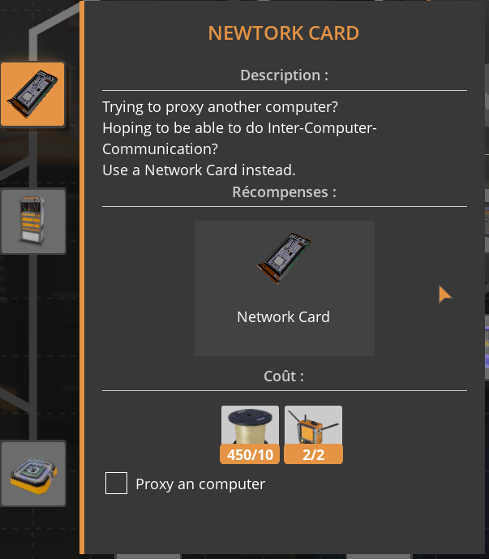

### Requirements
- 1 × Computer
- 1 × CPU
- 1 × Stick of RAM
- 1 × EEPROM (Text)


### Procedure
- Place a Computer in the world.
- Insert a Text EEPROM into the computer.
- Open the EEPROM editor.
- Name the Computer as 'Computer' a the right
- Insert the following Lua code.

```lua
-- Proxy_an_computer.lua : test minimal de connexion à un ordinateur

local id = component.findComponent("Computer")[1]

if id then
	local server = component.proxy(id)
	print("OK : Computer trouvé")
else
	print("NOK: Computer non trouvé")
end
```

### Expected Result
When the program runs, the computer console should display:
```
OK: Computer trouvé
```
If you see this message, you are succefuly make a proxy to an netwok Component
and you can proceed to the next MAM unlock step.

---
## Get a module of a control panel
The next step is to get a module of a control panel.

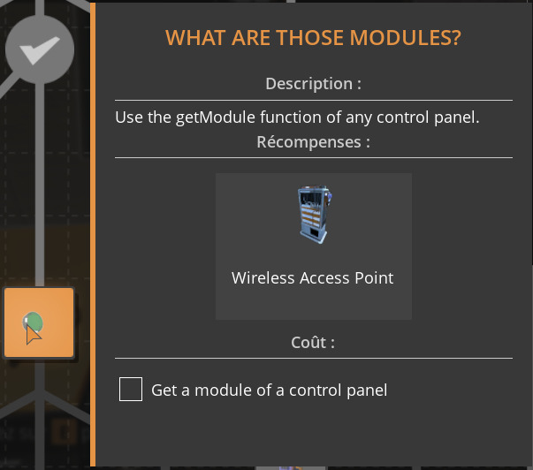

### Requirements
- 1 × Computer
- 1 × CPU
- 1 × Stick of RAM
- 1 × EEPROM (Text)
- 1 × Panel
- 1 × knob or Button
- 1 × Network pole

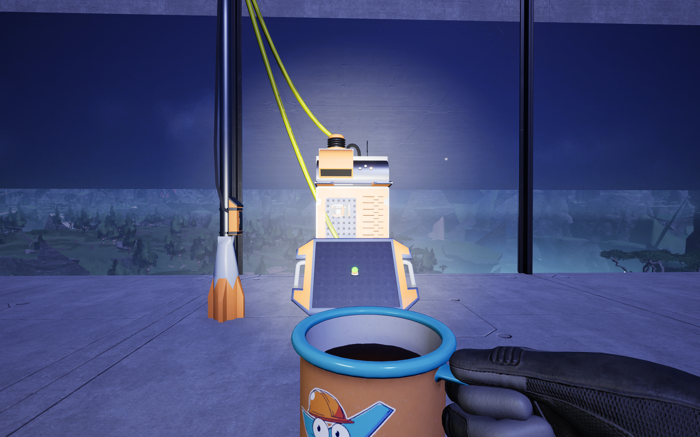


### Procedure
- Place a Computer in the world.
- Place the panel on the font.
- Place a network pole and connect each element.
- Place a knob or a button on the panel
- Set the name of the Panel with the Portable Network manager in hand to "Panel"
- Insert a Text EEPROM into the computer.
- Open the EEPROM editor.
- Name the Computer as 'Computer' a the right
- Insert the following Lua code.

```lua
-- Get_a_module_of_a_control_panel.lua
-- Version minimale : écoute les événements d'un panel et affiche la source

local PANEL_NICK = "Panel"
local MAX_X, MAX_Y, MAX_Z = 12, 12, 2

local ids = component.findComponent(PANEL_NICK)
if not ids or #ids == 0 then
    error("Panel introuvable: " .. PANEL_NICK)
end

local panel = component.proxy(ids[1])
local map = {}
local count = 0

for z = 0, MAX_Z do
    for y = 0, MAX_Y do
        for x = 0, MAX_X do
            local ok, mod = pcall(panel.getModule, panel, x, y, z)
            if ok and mod then
                map[tostring(mod)] = string.format("(%d,%d,%d)", x, y, z)
                event.listen(mod)
                count = count + 1
            end
        end
    end
end

print("Panel:", PANEL_NICK, "| modules écoutés:", count)
print("Appuie sur un bouton / tourne un knob...")

while true do
    local e = {event.pull()}
    local src = "?"
    for i = 2, #e do
        local p = map[tostring(e[i])]
        if p then src = p break end
    end
    print("[" .. tostring(e[1]) .. "] src=" .. src)
end

```

### Expected Result
When the program runs, you can activate a button and the computer console should display:
```
<Information about the component>
```
If you see this message, you are succefuly use a button and identify his information and you can proceed to the next MAM unlock step.


---
## Use the GPU T1 API
The next step is to Use the GPU T1 API.

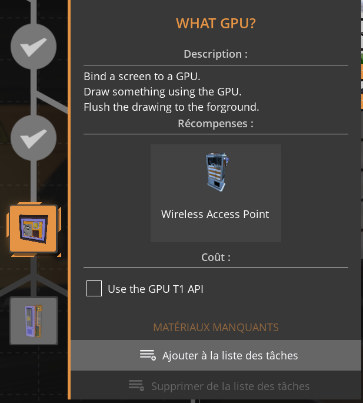

### Requirements
- 1 × Computer
- 1 × CPU
- 1 × Stick of RAM
- 1 × EEPROM (Text)
- 1 × GPU T1
- 1 × Sceen Driver

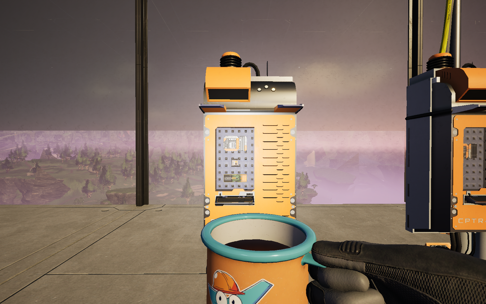


### Procedure
- Place a Computer in the world.
- Insert a Text EEPROM into the computer.
- Insert a GPU T1.
- Insert a Sceen Driver.
- Open the EEPROM editor.
- Name the Computer as 'Computer' a the right
- Insert the following Lua code.

```lua
-- Use_the_GPU_T1_API.lua
-- Minimal: affiche "Hello world" sur l'écran interne avec GPU T1

local gpu = computer.getPCIDevices(classes.Build_GPU_T1_C)[1]
local screen = computer.getPCIDevices(classes.FINComputerScreen)[1]

if not gpu or not screen then
    error("GPU T1 ou screen interne introuvable")
end

gpu:bindScreen(screen)
gpu:setBackground(0, 0, 0, 1)
gpu:setForeground(1, 1, 1, 1)

local s = gpu:getScreenSize()
gpu:fill(0, 0, s.x, s.y, " ", " ")
gpu:setText(2, 2, "Hello world")
gpu:flush()
```

### Expected Result
When the program runs, the computer console should display on the screen tab:
```
Hello world
```
If you see this message, you are succefuly use the GPU T1.


